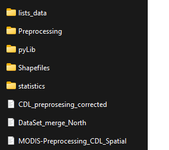

# Welcome to Crop Remote Sensing

In this repo you will find most of the code that you need to run the algorithms. I recommend you to first read my thesis to have a grasp of the problem and the required steps. 

I’m the second person to work on this project. I received code from a guy call Lutz, he worked mainly in the preprocessing of the MODIS data. So, I worked on top of his structure. 

To run this code, you will need to create this structure of folders. The main problem in the bugs of this code is the routes. So, take care that you are in the right directory calling the right files. 
I tried to make this folder structure in this repo so that you have an idea. Most of the folders here are empty, but when you run the code they will be filled with intermediate steps of the data processing.
 
There is a conda environment for windows [here](https://github.com/Monfiz/Anas_crop_remote_sensing/blob/main/environment.yml). 

In summary we need to:
## Download the data.

Modis data [here](https://search.earthdata.nasa.gov/search/granules?p=C194001241-LPDAAC_ECS&q=MOD13Q&sp[0]=-77.62698%2C41.89648&tl=1670935689!3!!&lat=33.890625&long=-146.8828125) , CDL data [here](https://www.nass.usda.gov/Research_and_Science/Cropland/Release/), statistics can be colected [here](https://quickstats.nass.usda.gov). Greenspin gave us this data digested but that data base is private. 

## Preprocess MODIS data

To get the data cube we use the notebook [MODIS-Preprocessing_CDL_Spatial.ipynb](https://github.com/Monfiz/Anas_crop_remote_sensing/blob/main/MODIS-Preprocessing_CDL_Spatial.ipynb) Which uses a lot of functions contained in [modisDataConverter.py](https://github.com/Monfiz/Anas_crop_remote_sensing/blob/main/pyLib/modis_lib/modisDataConverter.py).
## Preprocess CDL data

The rescaling takes place using QGIS. I made a [processor](https://github.com/Monfiz/Anas_crop_remote_sensing/blob/main/CDL_rescaleing_improved.model3) that automates many of the steps. 
The calibration and padding takes place in the notebook [CDL_preprosesing_corrected](https://github.com/Monfiz/Anas_crop_remote_sensing/blob/main/CDL_preprosesing_corrected.ipynb) wich uses lots of functions of [anas_functions.py](https://github.com/Monfiz/Anas_crop_remote_sensing/blob/main/pyLib/modis_lib/anas_functions.py). 
## Generate the split for training and testing.

This takes place in the notebook [DataSet_merge.ipynb](https://github.com/Monfiz/Anas_crop_remote_sensing/blob/main/DataSet_merge.ipynb).
## Train the algorithms 

I ended up trainig 4 models. You can find them in the folder [torch_models](https://github.com/Monfiz/Anas_crop_remote_sensing/tree/main/torch_models). 
## Apply metrics to the generated maps. 

This takes place in the notebook [4_models_comparation](https://github.com/Monfiz/Anas_crop_remote_sensing/blob/main/4_models_comparation.ipynb), wich uses lots of functions of 
[metrics_models.py](https://github.com/Monfiz/Anas_crop_remote_sensing/blob/main/torch_models/metrics_models.py).
